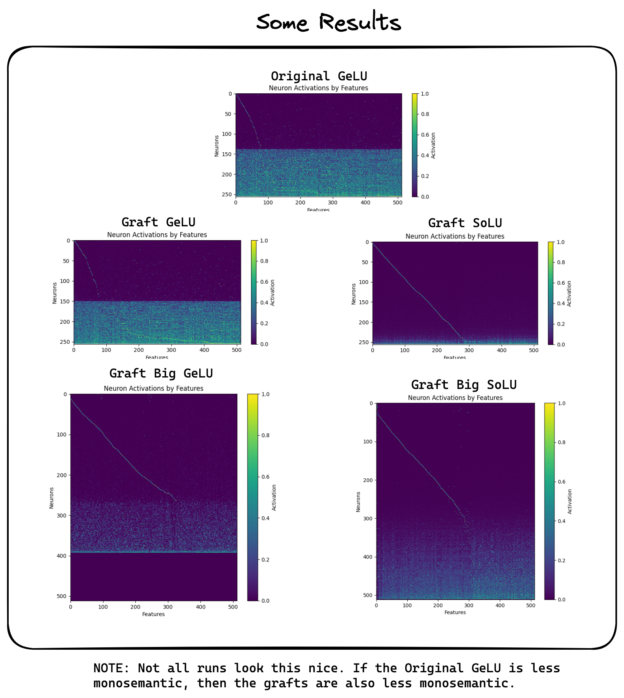

# solu-probe

## Idea
Make an MLP layer more interpretable by training a more interpretable model to mimic it.

## Implementation
So far the main experiment is in `projection.py` which first trains a model (see `mlp.py`) on toy projection data (see `toy_data.py`), then trains a model to mimic the first model's behaviour. The second model is either a GeLU or SoLU MLP.

I took the toy dataset setup, the monosemanticity metric, and the plot layout from [Engineering Monosemanticity in Toy Models](https://arxiv.org/pdf/2211.09169.pdf). SoLU is from [Softmax Linear Units](https://transformer-circuits.pub/2022/solu/index.html).

## Results

